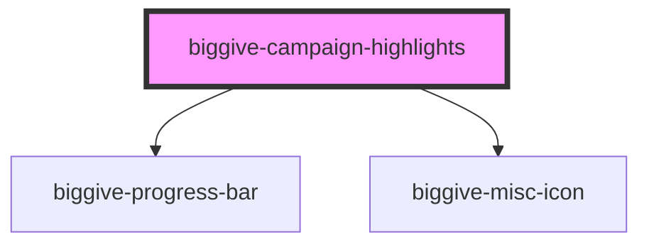

# biggive-campaign-highlights

<!-- Auto Generated Below -->

## Properties

| Property                | Attribute                 | Description                                                                                                                                                                                                              | Type     | Default     |
| ----------------------- | ------------------------- | ------------------------------------------------------------------------------------------------------------------------------------------------------------------------------------------------------------------------ | -------- | ----------- |
| `banner`                | `banner`                  | Full URL of a banner image.                                                                                                                                                                                              | `string` | `undefined` |
| `campaignTitle`         | `campaign-title`          | Display name of the charity's specific time-bound fundraising campaign.                                                                                                                                                  | `string` | `undefined` |
| `championName`          | `champion-name`           | Champion's name                                                                                                                                                                                                          | `string` | `undefined` |
| `championUrl`           | `champion-url`            | Link to all meta-campaigns funded by this champion. For example: /christmas-challenge-2022/the-reed-foundation-22 In other words, it follows the following format: '/' + campaign.parentRef + '/' + campaign.championRef | `string` | `undefined` |
| `primaryFigureAmount`   | `primary-figure-amount`   | Amount for the primary figure, formatted with currency symbol                                                                                                                                                            | `string` | `undefined` |
| `primaryFigureLabel`    | `primary-figure-label`    | Label for the primary figure                                                                                                                                                                                             | `string` | `undefined` |
| `primaryStatIcon`       | `primary-stat-icon`       | Primary stat icon                                                                                                                                                                                                        | `string` | `undefined` |
| `primaryStatText`       | `primary-stat-text`       | Primary stat text                                                                                                                                                                                                        | `string` | `undefined` |
| `progressBarCounter`    | `progress-bar-counter`    | Progress bar percentage                                                                                                                                                                                                  | `number` | `100`       |
| `secondaryFigureAmount` | `secondary-figure-amount` | Amount for the secondary figure, formatted with currency symbol                                                                                                                                                          | `string` | `undefined` |
| `secondaryFigureLabel`  | `secondary-figure-label`  | Label for the secondary figure                                                                                                                                                                                           | `string` | `undefined` |
| `secondaryStatIcon`     | `secondary-stat-icon`     | Secondary stat icon                                                                                                                                                                                                      | `string` | `undefined` |
| `secondaryStatText`     | `secondary-stat-text`     | Secondary stat text                                                                                                                                                                                                      | `string` | `undefined` |
| `spaceBelow`            | `space-below`             | Space below component                                                                                                                                                                                                    | `number` | `0`         |

## Dependencies

### Depends on

- [biggive-progress-bar](../biggive-progress-bar)
- [biggive-misc-icon](../biggive-misc-icon)

### Graph

----------------------------------------------

*Built with [StencilJS](https://stenciljs.com/)*
