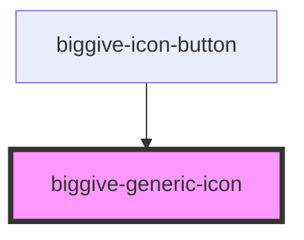

# biggive-generic-icon

<!-- Auto Generated Below -->

## Properties

| Property           | Attribute           | Description | Type                                                                                                                                                                                                               | Default     |
| ------------------ | ------------------- | ----------- | ------------------------------------------------------------------------------------------------------------------------------------------------------------------------------------------------------------------ | ----------- |
| `backgroundColour` | `background-colour` |             | `"black" \| "brand-1" \| "brand-2" \| "brand-3" \| "brand-4" \| "brand-5" \| "brand-6" \| "grey-dark" \| "grey-extra-light" \| "grey-light" \| "grey-medium" \| "primary" \| "secondary" \| "tertiary" \| "white"` | `'primary'` |
| `icon`             | `icon`              |             | `string`                                                                                                                                                                                                           | `undefined` |
| `iconColour`       | `icon-colour`       |             | `"black" \| "brand-1" \| "brand-2" \| "brand-3" \| "brand-4" \| "brand-5" \| "brand-6" \| "grey-dark" \| "grey-extra-light" \| "grey-light" \| "grey-medium" \| "primary" \| "secondary" \| "tertiary" \| "white"` | `'white'`   |
| `iconGroup`        | `icon-group`        |             | `"beneficiary" \| "category" \| "misc" \| "social"`                                                                                                                                                                | `undefined` |
| `url`              | `url`               |             | `string`                                                                                                                                                                                                           | `undefined` |

## Dependencies

### Used by

 - [biggive-icon-button](../biggive-icon-button)

### Graph

----------------------------------------------

*Built with [StencilJS](https://stenciljs.com/)*
