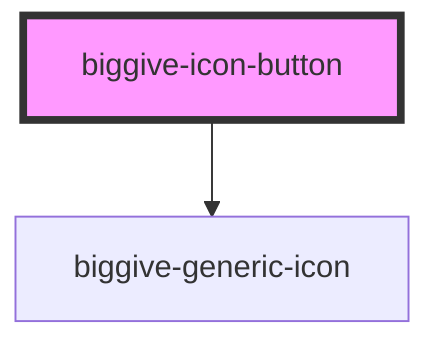

# biggive-icon-button

<!-- Auto Generated Below -->

## Properties

| Property            | Attribute            | Description | Type                                                                                                                                                                                                               | Default     |
| ------------------- | -------------------- | ----------- | ------------------------------------------------------------------------------------------------------------------------------------------------------------------------------------------------------------------ | ----------- |
| `arrow`             | `arrow`              |             | `boolean`                                                                                                                                                                                                          | `false`     |
| `arrowColour`       | `arrow-colour`       |             | `"black" \| "brand-1" \| "brand-2" \| "brand-3" \| "brand-4" \| "brand-5" \| "brand-6" \| "grey-dark" \| "grey-extra-light" \| "grey-light" \| "grey-medium" \| "primary" \| "secondary" \| "tertiary" \| "white"` | `'black'`   |
| `backgroundColour`  | `background-colour`  |             | `"black" \| "brand-1" \| "brand-2" \| "brand-3" \| "brand-4" \| "brand-5" \| "brand-6" \| "grey-dark" \| "grey-extra-light" \| "grey-light" \| "grey-medium" \| "primary" \| "secondary" \| "tertiary" \| "white"` | `'white'`   |
| `backgroundPadding` | `background-padding` |             | `0 \| 1 \| 2 \| 3 \| 4 \| 5 \| 6`                                                                                                                                                                                  | `0`         |
| `buttonId`          | `button-id`          |             | `string \| undefined`                                                                                                                                                                                              | `undefined` |
| `centered`          | `centered`           |             | `boolean`                                                                                                                                                                                                          | `false`     |
| `circle`            | `circle`             |             | `boolean`                                                                                                                                                                                                          | `false`     |
| `icon`              | `icon`               |             | `string`                                                                                                                                                                                                           | `undefined` |
| `iconGroup`         | `icon-group`         |             | `"beneficiary" \| "category" \| "misc" \| "social"`                                                                                                                                                                | `undefined` |
| `openInNewTab`      | `open-in-new-tab`    |             | `boolean`                                                                                                                                                                                                          | `false`     |
| `rounded`           | `rounded`            |             | `boolean`                                                                                                                                                                                                          | `false`     |
| `shadow`            | `shadow`             |             | `boolean`                                                                                                                                                                                                          | `false`     |
| `size`              | `size`               |             | `"large" \| "medium" \| "small" \| "x-large" \| "xx-large"`                                                                                                                                                        | `'medium'`  |
| `spaceBelow`        | `space-below`        |             | `0 \| 1 \| 2 \| 3 \| 4 \| 5 \| 6`                                                                                                                                                                                  | `1`         |
| `text`              | `text`               |             | `string`                                                                                                                                                                                                           | `undefined` |
| `textColour`        | `text-colour`        |             | `"black" \| "brand-1" \| "brand-2" \| "brand-3" \| "brand-4" \| "brand-5" \| "brand-6" \| "grey-dark" \| "grey-extra-light" \| "grey-light" \| "grey-medium" \| "primary" \| "secondary" \| "tertiary" \| "white"` | `'black'`   |
| `url`               | `url`                |             | `string`                                                                                                                                                                                                           | `undefined` |

## Events

| Event           | Description | Type                                           |
| --------------- | ----------- | ---------------------------------------------- |
| `doButtonClick` |             | `CustomEvent<{ event: object; url: string; }>` |

## Dependencies

### Depends on

- [biggive-generic-icon](../biggive-generic-icon)

### Graph

----------------------------------------------

*Built with [StencilJS](https://stenciljs.com/)*
