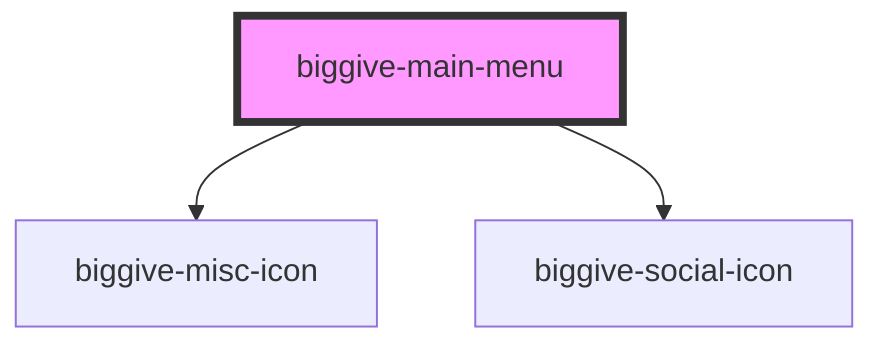

# biggive-main-menu

<!-- Auto Generated Below -->

## Properties

| Property               | Attribute                 | Description                                                                                                                                                                                                   | Type                  | Default     |
| ---------------------- | ------------------------- | ------------------------------------------------------------------------------------------------------------------------------------------------------------------------------------------------------------- | --------------------- | ----------- |
| `blogUrlPrefix`        | `blog-url-prefix`         |                                                                                                                                                                                                               | `string \| undefined` | `undefined` |
| `donateUrlPrefix`      | `donate-url-prefix`       | E.g. "https://donate.thebiggive.org.uk" for production (currently)                                                                                                                                            | `string \| undefined` | `undefined` |
| `experienceUrlPrefix`  | `experience-url-prefix`   |                                                                                                                                                                                                               | `string \| undefined` | `undefined` |
| `isLoggedIn`           | `is-logged-in`            | Whether the current user is logged in (i.e. is assumed to have a valid JWT). They get links to some extra content if they are.                                                                                | `boolean`             | `false`     |
| `logoUrl`              | `logo-url`                |                                                                                                                                                                                                               | `string`              | `'/'`       |
| `usePresetMenuContent` | `use-preset-menu-content` | If true, content passed in via slots will be ignored, and this will just render a hard-coded menu that's the same everywhere. When BG2-2286 is done this will be permantly true and the prop will be deleted. | `boolean`             | `false`     |

## Methods

### `closeMobileMenuFromOutside() => Promise<void>`

#### Returns

Type: `Promise<void>`

## Dependencies

### Depends on

- [biggive-misc-icon](../biggive-misc-icon)
- [biggive-social-icon](../biggive-social-icon)

### Graph

----------------------------------------------

*Built with [StencilJS](https://stenciljs.com/)*
