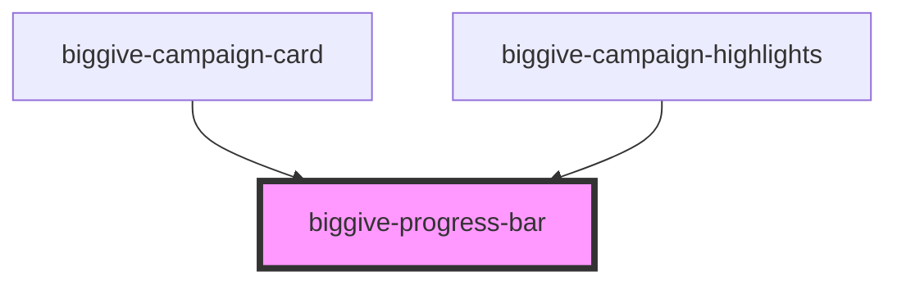

# biggive-progress-bar

<!-- Auto Generated Below -->

## Properties

| Property       | Attribute       | Description                                                           | Type     | Default     |
| -------------- | --------------- | --------------------------------------------------------------------- | -------- | ----------- |
| `colourScheme` | `colour-scheme` | Colour Scheme                                                         | `string` | `'primary'` |
| `counter`      | `counter`       | Percentage to show + use for CSS width; round before input if desired | `number` | `100`       |
| `spaceBelow`   | `space-below`   | Space below component                                                 | `number` | `0`         |

## Dependencies

### Used by

 - [biggive-campaign-card](../biggive-campaign-card)
 - [biggive-campaign-highlights](../biggive-campaign-highlights)

### Graph

----------------------------------------------

*Built with [StencilJS](https://stenciljs.com/)*
