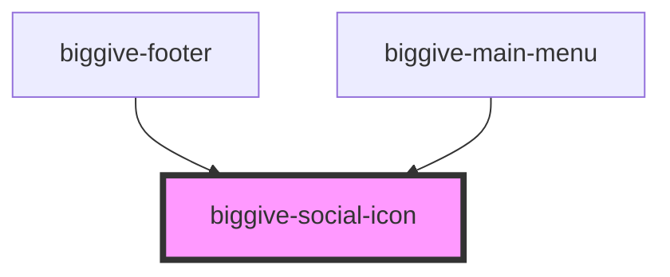

# biggive-social-icon

<!-- Auto Generated Below -->

## Overview

Used to indicate and link to a charity's social page, or their own web site.

## Properties

| Property               | Attribute           | Description                                                                                                    | Type                                                                                       | Default      |
| ---------------------- | ------------------- | -------------------------------------------------------------------------------------------------------------- | ------------------------------------------------------------------------------------------ | ------------ |
| `backgroundColour`     | `background-colour` | Background colour                                                                                              | `string`                                                                                   | `'primary'`  |
| `iconColour`           | `icon-colour`       | Icon colour                                                                                                    | `string`                                                                                   | `'white'`    |
| `labelPrefix`          | `label-prefix`      | Used within accessible labels for links. Typically a charity name or "Big Give". Can also be "Share".          | `string`                                                                                   | `'Big Give'` |
| `service` _(required)_ | `service`           | Service name                                                                                                   | `"Facebook" \| "Instagram" \| "LinkedIn" \| "Twitter" \| "Web" \| "Whatsapp" \| "YouTube"` | `undefined`  |
| `url`                  | `url`               | Url                                                                                                            | `string`                                                                                   | `'#'`        |
| `wide`                 | `wide`              | Used in the social icons in the biggive-footer, which are more spaced out than others across the site. COM-43. | `boolean`                                                                                  | `false`      |

## Dependencies

### Used by

 - [biggive-footer](../biggive-footer)
 - [biggive-main-menu](../biggive-main-menu)

### Graph

----------------------------------------------

*Built with [StencilJS](https://stenciljs.com/)*
