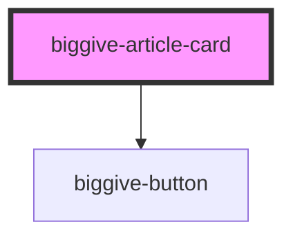

# biggive-basic-card

<!-- Auto Generated Below -->

## Properties

| Property                | Attribute                 | Description                  | Type     | Default      |
| ----------------------- | ------------------------- | ---------------------------- | -------- | ------------ |
| `backgroundColour`      | `background-colour`       | Card background colour       | `string` | `'white'`    |
| `backgroundColourHover` | `background-colour-hover` | Card background colour hover | `string` | `'tertiary'` |
| `buttonLabel`           | `button-label`            | Button label                 | `string` | `null`       |
| `buttonUrl`             | `button-url`              | Button URL                   | `string` | `null`       |
| `date`                  | `date`                    | Date                         | `string` | `null`       |
| `imageAltText`          | `image-alt-text`          | Image Alt Text               | `string` | `null`       |
| `imageLabel`            | `image-label`             | Image Label                  | `string` | `null`       |
| `imageUrl`              | `image-url`               | Image URL                    | `string` | `null`       |
| `mainTitle`             | `main-title`              | Main title                   | `string` | `null`       |
| `slug`                  | `slug`                    | Slug                         | `string` | `null`       |
| `spaceBelow`            | `space-below`             | Space below component        | `number` | `0`          |
| `textColour`            | `text-colour`             | Text colour                  | `string` | `'black'`    |

## Dependencies

### Depends on

- [biggive-button](../biggive-button)

### Graph

----------------------------------------------

*Built with [StencilJS](https://stenciljs.com/)*
