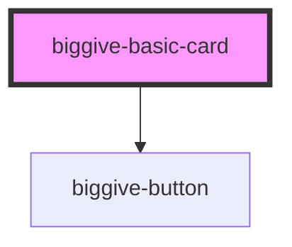

# biggive-basic-card

<!-- Auto Generated Below -->

## Properties

| Property               | Attribute                 | Description                       | Type                         | Default           |
| ---------------------- | ------------------------- | --------------------------------- | ---------------------------- | ----------------- |
| `addAnimation`         | `add-animation`           |                                   | `boolean`                    | `false`           |
| `backgroundColour`     | `background-colour`       | Background colour.                | `string`                     | `'primary'`       |
| `backgroundImageUrl`   | `background-image-url`    | Full URL of the background image. | `string`                     | `''`              |
| `buttonColourScheme`   | `button-colour-scheme`    | Button Colour Scheme              | `string`                     | `'clear-primary'` |
| `buttonLabel`          | `button-label`            | Button label                      | `string`                     | `undefined`       |
| `buttonUrl`            | `button-url`              | Button URL                        | `string`                     | `undefined`       |
| `cardColour`           | `card-colour`             | Card colour                       | `string`                     | `'white'`         |
| `clipBottomLeftCorner` | `clip-bottom-left-corner` | Clip bottom left corner           | `boolean`                    | `true`            |
| `clipTopRightCorner`   | `clip-top-right-corner`   | Clip top right corner             | `boolean`                    | `true`            |
| `headingLevel`         | `heading-level`           |                                   | `1 \| 2 \| 3 \| 4 \| 5 \| 6` | `3`               |
| `icon`                 | `icon`                    | Icon                              | `boolean`                    | `true`            |
| `iconColour`           | `icon-colour`             | Icon colour                       | `string`                     | `'primary'`       |
| `mainTitle`            | `main-title`              | Main title                        | `string`                     | `undefined`       |
| `spaceBelow`           | `space-below`             | Space below component             | `number`                     | `0`               |
| `subtitle`             | `subtitle`                | Subtitle title                    | `string`                     | `undefined`       |
| `teaser`               | `teaser`                  | Teaser                            | `string`                     | `undefined`       |
| `textColour`           | `text-colour`             | Text colour                       | `string`                     | `'black'`         |

## Dependencies

### Depends on

- [biggive-button](../biggive-button)

### Graph

----------------------------------------------

*Built with [StencilJS](https://stenciljs.com/)*
