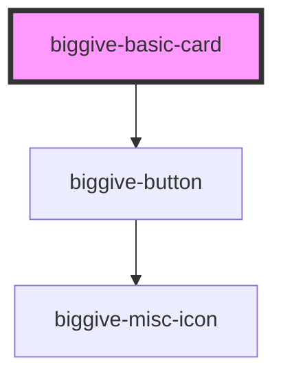

# biggive-basic-card

<!-- Auto Generated Below -->

## Properties

| Property             | Attribute              | Description                       | Type     | Default           |
| -------------------- | ---------------------- | --------------------------------- | -------- | ----------------- |
| `backgroundColour`   | `background-colour`    | Background colour.                | `string` | `'primary'`       |
| `backgroundImageUrl` | `background-image-url` | Full URL of the background image. | `string` | `''`              |
| `buttonColourScheme` | `button-colour-scheme` | Button Colour Scheme              | `string` | `'clear-primary'` |
| `buttonLabel`        | `button-label`         | Button label                      | `string` | `null`            |
| `buttonUrl`          | `button-url`           | Button URL                        | `string` | `null`            |
| `cardColour`         | `card-colour`          | Card colour                       | `string` | `'white'`         |
| `iconColour`         | `icon-colour`          | Icon colour                       | `string` | `'primary'`       |
| `mainTitle`          | `main-title`           | Main title                        | `string` | `null`            |
| `spaceBelow`         | `space-below`          | Space below component             | `number` | `0`               |
| `subtitle`           | `subtitle`             | Subtitle title                    | `string` | `null`            |
| `textColour`         | `text-colour`          | Text colour                       | `string` | `'black'`         |

## Dependencies

### Depends on

- [biggive-button](../biggive-button)

### Graph

----------------------------------------------

*Built with [StencilJS](https://stenciljs.com/)*
