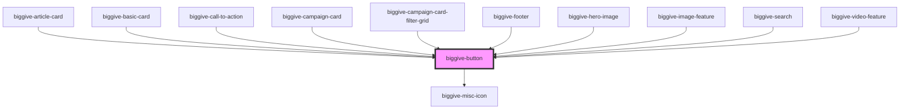

# biggive-button

<!-- Auto Generated Below -->

## Properties

| Property           | Attribute            | Description                                                                                                                                                                                             | Type      | Default      |
| ------------------ | -------------------- | ------------------------------------------------------------------------------------------------------------------------------------------------------------------------------------------------------- | --------- | ------------ |
| `colourScheme`     | `colour-scheme`      | Colour Scheme                                                                                                                                                                                           | `string`  | `'primary'`  |
| `datetime`         | `datetime`           | To be used alongside isFutureCampaign = true or isPastCampaign = true. If either is true, we render out: 'Launches: ' + datetime or 'Closed: ' + datetime. Preferred format: DD/MM/YYYY, HH:MM DON-661. | `string`  | `undefined`  |
| `fullWidth`        | `full-width`         | Display full width                                                                                                                                                                                      | `boolean` | `false`      |
| `isFutureCampaign` | `is-future-campaign` | Boolean flag telling the component if the campaign is in the future (not open yet).                                                                                                                     | `boolean` | `false`      |
| `isPastCampaign`   | `is-past-campaign`   | Boolean flag telling the component if the campaign is in the future (not open yet).                                                                                                                     | `boolean` | `false`      |
| `label`            | `label`              | Text                                                                                                                                                                                                    | `string`  | `'Click me'` |
| `rounded`          | `rounded`            | Rounded corners                                                                                                                                                                                         | `boolean` | `false`      |
| `size`             | `size`               | Size                                                                                                                                                                                                    | `string`  | `'medium'`   |
| `spaceBelow`       | `space-below`        | Space below component                                                                                                                                                                                   | `number`  | `1`          |
| `url`              | `url`                | URL                                                                                                                                                                                                     | `string`  | `undefined`  |

## Events

| Event           | Description | Type                                           |
| --------------- | ----------- | ---------------------------------------------- |
| `doButtonClick` |             | `CustomEvent<{ event: object; url: string; }>` |

## Dependencies

### Used by

 - [biggive-article-card](../biggive-article-card)
 - [biggive-basic-card](../biggive-basic-card)
 - [biggive-call-to-action](../biggive-call-to-action)
 - [biggive-campaign-card](../biggive-campaign-card)
 - [biggive-campaign-card-filter-grid](../biggive-campaign-card-filter-grid)
 - [biggive-footer](../biggive-footer)
 - [biggive-hero-image](../biggive-hero-image)
 - [biggive-image-feature](../biggive-image-feature)
 - [biggive-search](../biggive-search)
 - [biggive-video-feature](../biggive-video-feature)

### Depends on

- [biggive-misc-icon](../biggive-misc-icon)

### Graph

----------------------------------------------

*Built with [StencilJS](https://stenciljs.com/)*
