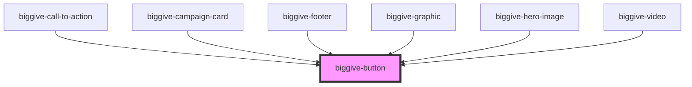

# biggive-button

<!-- Auto Generated Below -->

## Properties

| Property       | Attribute       | Description   | Type     | Default      |
| -------------- | --------------- | ------------- | -------- | ------------ |
| `colourScheme` | `colour-scheme` | Colour Scheme | `string` | `'primary'`  |
| `label`        | `label`         | Text          | `string` | `'Click me'` |
| `url`          | `url`           | URL           | `string` | `'#'`        |

## Dependencies

### Used by

 - [biggive-call-to-action](../biggive-call-to-action)
 - [biggive-campaign-card](../biggive-campaign-card)
 - [biggive-footer](../biggive-footer)
 - [biggive-graphic](../biggive-graphic)
 - [biggive-hero-image](../biggive-hero-image)
 - [biggive-video](../biggive-video)

### Graph

----------------------------------------------

*Built with [StencilJS](https://stenciljs.com/)*
