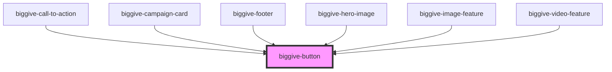

# biggive-button

<!-- Auto Generated Below -->

## Properties

| Property       | Attribute       | Description           | Type      | Default      |
| -------------- | --------------- | --------------------- | --------- | ------------ |
| `colourScheme` | `colour-scheme` | Colour Scheme         | `string`  | `'primary'`  |
| `fullWidth`    | `full-width`    | Display full width    | `boolean` | `false`      |
| `label`        | `label`         | Text                  | `string`  | `'Click me'` |
| `spaceBelow`   | `space-below`   | Space below component | `number`  | `1`          |
| `url`          | `url`           | URL                   | `string`  | `'#'`        |

## Dependencies

### Used by

 - [biggive-call-to-action](../biggive-call-to-action)
 - [biggive-campaign-card](../biggive-campaign-card)
 - [biggive-footer](../biggive-footer)
 - [biggive-hero-image](../biggive-hero-image)
 - [biggive-image-feature](../biggive-image-feature)
 - [biggive-video-feature](../biggive-video-feature)

### Graph

----------------------------------------------

*Built with [StencilJS](https://stenciljs.com/)*
