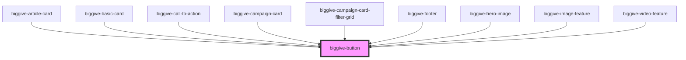

# biggive-button

<!-- Auto Generated Below -->

## Properties

| Property       | Attribute         | Description           | Type                  | Default      |
| -------------- | ----------------- | --------------------- | --------------------- | ------------ |
| `buttonId`     | `button-id`       |                       | `string \| undefined` | `undefined`  |
| `centered`     | `centered`        | Centered              | `boolean`             | `false`      |
| `colourScheme` | `colour-scheme`   | Colour Scheme         | `string`              | `'primary'`  |
| `fullWidth`    | `full-width`      | Display full width    | `boolean`             | `false`      |
| `label`        | `label`           | Text                  | `string`              | `'Click me'` |
| `openInNewTab` | `open-in-new-tab` | New Tab               | `boolean`             | `false`      |
| `rounded`      | `rounded`         | Rounded corners       | `boolean`             | `false`      |
| `size`         | `size`            | Size                  | `string`              | `'medium'`   |
| `spaceBelow`   | `space-below`     | Space below component | `number`              | `1`          |
| `url`          | `url`             | URL                   | `string`              | `undefined`  |

## Events

| Event           | Description | Type                                           |
| --------------- | ----------- | ---------------------------------------------- |
| `doButtonClick` |             | `CustomEvent<{ event: object; url: string; }>` |

## Dependencies

### Used by

 - [biggive-article-card](../biggive-article-card)
 - [biggive-basic-card](../biggive-basic-card)
 - [biggive-call-to-action](../biggive-call-to-action)
 - [biggive-campaign-card](../biggive-campaign-card)
 - [biggive-campaign-card-filter-grid](../biggive-campaign-card-filter-grid)
 - [biggive-footer](../biggive-footer)
 - [biggive-hero-image](../biggive-hero-image)
 - [biggive-image-feature](../biggive-image-feature)
 - [biggive-video-feature](../biggive-video-feature)

### Graph

----------------------------------------------

*Built with [StencilJS](https://stenciljs.com/)*
