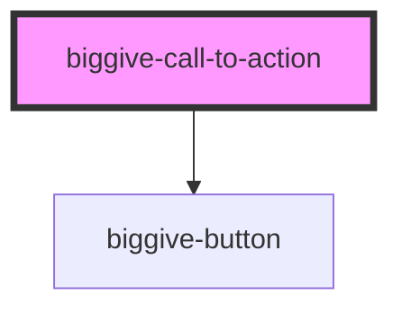

# biggive-call-to-action

<!-- Auto Generated Below -->

## Properties

| Property                      | Attribute                        | Description                    | Type     | Default     |
| ----------------------------- | -------------------------------- | ------------------------------ | -------- | ----------- |
| `defaultTextColour`           | `default-text-colour`            | Default text colour            | `string` | `'primary'` |
| `mainTitle`                   | `main-title`                     | Main title                     | `string` | `null`      |
| `mainTitleColour`             | `main-title-colour`              | Main title colour              | `string` | `''`        |
| `mainTitleSize`               | `main-title-size`                | Main title size                | `number` | `2`         |
| `primaryButtonColourScheme`   | `primary-button-colour-scheme`   | Primary button Colour Scheme   | `string` | `'primary'` |
| `primaryButtonLabel`          | `primary-button-label`           | Primary button Label           | `string` | `null`      |
| `primaryButtonUrl`            | `primary-button-url`             | Primary button Url             | `string` | `null`      |
| `secondaryButtonColourScheme` | `secondary-button-colour-scheme` | Secondary button Colour Scheme | `string` | `'primary'` |
| `secondaryButtonLabel`        | `secondary-button-label`         | Secondary button Label         | `string` | `null`      |
| `secondaryButtonUrl`          | `secondary-button-url`           | Secondary button Url           | `string` | `null`      |
| `slug`                        | `slug`                           | Slug                           | `string` | `null`      |
| `slugColour`                  | `slug-colour`                    | Slug colour                    | `string` | `''`        |
| `slugSize`                    | `slug-size`                      | Slug size                      | `number` | `4`         |
| `spaceAbove`                  | `space-above`                    | Space above component          | `number` | `0`         |
| `spaceBelow`                  | `space-below`                    | Space below component          | `number` | `0`         |
| `subtitle`                    | `subtitle`                       | Subtitle                       | `string` | `null`      |
| `subtitleColour`              | `subtitle-colour`                | Subtitle colour                | `string` | `''`        |
| `subtitleSize`                | `subtitle-size`                  | Main title size                | `number` | `4`         |
| `teaser`                      | `teaser`                         | Teaser                         | `string` | `null`      |
| `teaserColour`                | `teaser-colour`                  | Teaser colour                  | `string` | `''`        |

## Dependencies

### Depends on

- [biggive-button](../biggive-button)

### Graph

----------------------------------------------

*Built with [StencilJS](https://stenciljs.com/)*
