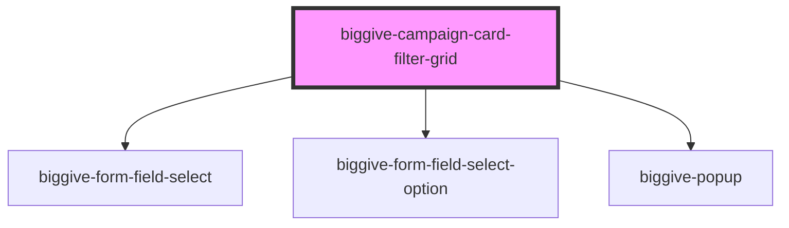

# biggive-campaign-filter-grid

<!-- Auto Generated Below -->

## Properties

| Property            | Attribute            | Description                                                                                     | Type     | Default                       |
| ------------------- | -------------------- | ----------------------------------------------------------------------------------------------- | -------- | ----------------------------- |
| `beneficaryOptions` | `beneficary-options` | JSON array of beneficary key/values                                                             | `string` | `null`                        |
| `buttonText`        | `button-text`        | Defines the text on the search button                                                           | `string` | `'Search'`                    |
| `categoryOptions`   | `category-options`   | JSON array of category key/values                                                               | `string` | `null`                        |
| `filterBeneficary`  | `filter-beneficary`  |                                                                                                 | `string` | `null`                        |
| `filterCategory`    | `filter-category`    |                                                                                                 | `string` | `null`                        |
| `filterFunding`     | `filter-funding`     |                                                                                                 | `string` | `null`                        |
| `filterLocation`    | `filter-location`    |                                                                                                 | `string` | `null`                        |
| `fundingOptions`    | `funding-options`    | JSON array of funding key/values                                                                | `string` | `null`                        |
| `intro`             | `intro`              | Intro                                                                                           | `string` | `'Find a charity or project'` |
| `locationOptions`   | `location-options`   | JSON array of location key/values                                                               | `string` | `null`                        |
| `placeholderText`   | `placeholder-text`   | Defines the text displayed as the placeholder in the input field before the user types anything | `string` | `'Search'`                    |
| `searchText`        | `search-text`        |                                                                                                 | `string` | `null`                        |
| `sortBy`            | `sort-by`            |                                                                                                 | `string` | `null`                        |
| `spaceBelow`        | `space-below`        | Space below component                                                                           | `number` | `0`                           |

## Events

| Event                     | Description                                                                                    | Type                  |
| ------------------------- | ---------------------------------------------------------------------------------------------- | --------------------- |
| `doSearchAndFilterUpdate` | This event `doChange` event is emitted and propogates to the parent component which handles it | `CustomEvent<object>` |

## Dependencies

### Depends on

- [biggive-form-field-select](../biggive-form-field-select)
- [biggive-form-field-select-option](../biggive-form-field-select-option)
- [biggive-popup](../biggive-popup)

### Graph

----------------------------------------------

*Built with [StencilJS](https://stenciljs.com/)*
