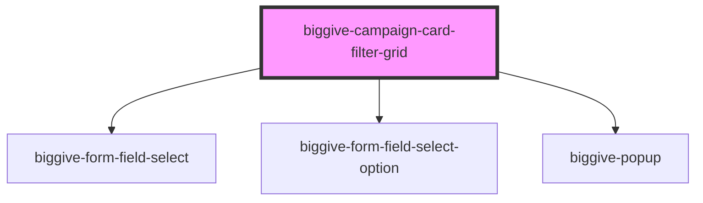

# biggive-campaign-filter-grid

<!-- Auto Generated Below -->

## Properties

| Property             | Attribute          | Description                                                                                     | Type       | Default                       |
| -------------------- | ------------------ | ----------------------------------------------------------------------------------------------- | ---------- | ----------------------------- |
| `beneficiaryOptions` | --                 | JSON array of beneficiary key/values                                                            | `string[]` | `null`                        |
| `buttonText`         | `button-text`      | Defines the text on the search button                                                           | `string`   | `'Search'`                    |
| `categoryOptions`    | --                 | JSON array of category key/values                                                               | `string[]` | `null`                        |
| `fundingOptions`     | --                 | JSON array of funding key/values                                                                | `string[]` | `null`                        |
| `intro`              | `intro`            | Intro                                                                                           | `string`   | `'Find a charity or project'` |
| `locationOptions`    | --                 | JSON array of location key/values                                                               | `string[]` | `null`                        |
| `placeholderText`    | `placeholder-text` | Defines the text displayed as the placeholder in the input field before the user types anything | `string`   | `'Search'`                    |
| `spaceBelow`         | `space-below`      | Space below component                                                                           | `number`   | `0`                           |

## Events

| Event                     | Description                                                                                                   | Type                                |
| ------------------------- | ------------------------------------------------------------------------------------------------------------- | ----------------------------------- |
| `doSearchAndFilterUpdate` | This event `doSearchAndFilterUpdate` event is emitted and propogates to the parent component which handles it | `CustomEvent<SearchAndFilterEvent>` |

## Dependencies

### Depends on

- [biggive-form-field-select](../biggive-form-field-select)
- [biggive-form-field-select-option](../biggive-form-field-select-option)
- [biggive-popup](../biggive-popup)

### Graph

----------------------------------------------

*Built with [StencilJS](https://stenciljs.com/)*
