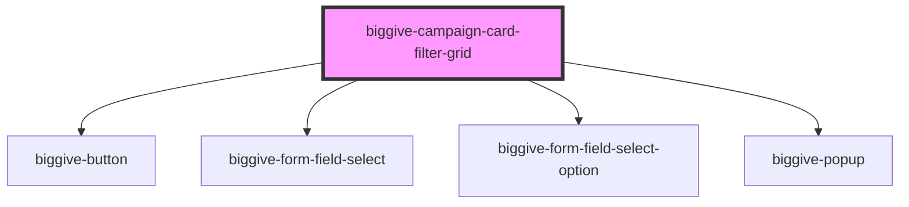

# biggive-campaign-filter-grid

<!-- Auto Generated Below -->

## Properties

| Property             | Attribute          | Description                                                                                                                                                                                                                                                                                                                                                                            | Type                                                      | Default                       |
| -------------------- | ------------------ | -------------------------------------------------------------------------------------------------------------------------------------------------------------------------------------------------------------------------------------------------------------------------------------------------------------------------------------------------------------------------------------- | --------------------------------------------------------- | ----------------------------- |
| `beneficiaryOptions` | --                 | JSON array of beneficiary key/values                                                                                                                                                                                                                                                                                                                                                   | `string[]`                                                | `[]`                          |
| `buttonText`         | `button-text`      | Defines the text on the search button                                                                                                                                                                                                                                                                                                                                                  | `string`                                                  | `'Search'`                    |
| `categoryOptions`    | --                 | JSON array of category key/values                                                                                                                                                                                                                                                                                                                                                      | `string[]`                                                | `[]`                          |
| `fundingOptions`     | --                 | JSON array of funding key/values                                                                                                                                                                                                                                                                                                                                                       | `string[]`                                                | `[]`                          |
| `intro`              | `intro`            | Intro                                                                                                                                                                                                                                                                                                                                                                                  | `string`                                                  | `'Find a charity or project'` |
| `locationOptions`    | --                 | JSON array of location key/values                                                                                                                                                                                                                                                                                                                                                      | `string[]`                                                | `[]`                          |
| `placeholderText`    | `placeholder-text` | Defines the text displayed as the placeholder in the input field before the user types anything                                                                                                                                                                                                                                                                                        | `string`                                                  | `'Search'`                    |
| `selectedLabel`      | `selected-label`   | This helps us inject a pre-selected dropdown value from outside of this component. This is especially helpful for the Meta campaign and Explore pages, where searching by text whipes out previous sort options and re-uses Relevance, or where one of those two pages is loaded directly with URL parameters - in such a scenario the dropdown shows that it's pre-selected. DON-558. | `"Match funds remaining" \| "Most raised" \| "Relevance"` | `null`                        |
| `spaceBelow`         | `space-below`      | Space below component                                                                                                                                                                                                                                                                                                                                                                  | `number`                                                  | `0`                           |

## Events

| Event                     | Description                                                                                                   | Type                                                                                                                                                     |
| ------------------------- | ------------------------------------------------------------------------------------------------------------- | -------------------------------------------------------------------------------------------------------------------------------------------------------- |
| `doSearchAndFilterUpdate` | This event `doSearchAndFilterUpdate` event is emitted and propogates to the parent component which handles it | `CustomEvent<{ searchText: string; sortBy: string; filterCategory: string; filterBeneficiary: string; filterLocation: string; filterFunding: string; }>` |

## Dependencies

### Depends on

- [biggive-button](../biggive-button)
- [biggive-form-field-select](../biggive-form-field-select)
- [biggive-form-field-select-option](../biggive-form-field-select-option)
- [biggive-popup](../biggive-popup)

### Graph

----------------------------------------------

*Built with [StencilJS](https://stenciljs.com/)*
