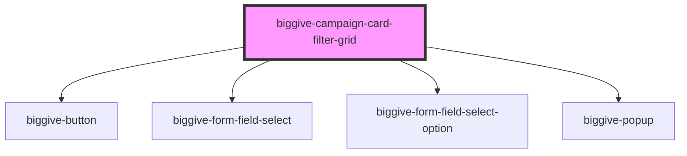

# biggive-campaign-filter-grid

<!-- Auto Generated Below -->

## Properties

| Property                    | Attribute                     | Description                                                                                                                                                                                                                                                                                                                                                                                    | Type                                                      | Default                       |
| --------------------------- | ----------------------------- | ---------------------------------------------------------------------------------------------------------------------------------------------------------------------------------------------------------------------------------------------------------------------------------------------------------------------------------------------------------------------------------------------- | --------------------------------------------------------- | ----------------------------- |
| `beneficiaryOptions`        | `beneficiary-options`         | JSON array of beneficiary key/values, or takes a stringified equiavalent (for Storybook)                                                                                                                                                                                                                                                                                                       | `string \| string[]`                                      | `[]`                          |
| `buttonText`                | `button-text`                 | Defines the text on the search button                                                                                                                                                                                                                                                                                                                                                          | `string`                                                  | `'Search'`                    |
| `categoryOptions`           | `category-options`            | JSON array of category key/values, or takes a stringified equiavalent (for Storybook)                                                                                                                                                                                                                                                                                                          | `string \| string[]`                                      | `[]`                          |
| `fundingOptions`            | `funding-options`             | JSON array of funding key/values, or takes a stringified equiavalent (for Storybook)                                                                                                                                                                                                                                                                                                           | `string \| string[]`                                      | `[]`                          |
| `intro`                     | `intro`                       | Intro                                                                                                                                                                                                                                                                                                                                                                                          | `string`                                                  | `'Find a charity or project'` |
| `locationOptions`           | `location-options`            | JSON array of location key/values, or takes a stringified equiavalent (for Storybook)                                                                                                                                                                                                                                                                                                          | `string \| string[]`                                      | `[]`                          |
| `placeholderText`           | `placeholder-text`            | Defines the text displayed as the placeholder in the input field before the user types anything                                                                                                                                                                                                                                                                                                | `string`                                                  | `'Search'`                    |
| `searchText`                | `search-text`                 | Optional search text prop. Useful for pre-populating the search field when the page is loaded with a search term already existing in the URL. This can happen when sharing links, or if a donor goes to a campaign page after searching, and then returns to the search results. In such a case, the search box text will clear, unless we use this prop to populate it on rendering. DON-652. | `string`                                                  | `null`                        |
| `selectedFilterBeneficiary` | `selected-filter-beneficiary` | For injecting the chosen beneficiary to filter by, as per the comment above for `selectedSortByOption`.                                                                                                                                                                                                                                                                                        | `string`                                                  | `null`                        |
| `selectedFilterCategory`    | `selected-filter-category`    | For injecting the chosen category to filter by, as per the comment above for `selectedSortByOption`.                                                                                                                                                                                                                                                                                           | `string`                                                  | `null`                        |
| `selectedFilterFunding`     | `selected-filter-funding`     | For injecting the chosen funding to filter by, as per the comment above for `selectedSortByOption`.                                                                                                                                                                                                                                                                                            | `string`                                                  | `null`                        |
| `selectedFilterLocation`    | `selected-filter-location`    | For injecting the chosen location to filter by, as per the comment above for `selectedSortByOption`.                                                                                                                                                                                                                                                                                           | `string`                                                  | `null`                        |
| `selectedSortByOption`      | `selected-sort-by-option`     | This helps us inject a pre-selected dropdown value from outside of this component. This is especially helpful for the Meta campaign and Explore pages, where searching by text whipes out previous sort options and re-uses Relevance, or where one of those two pages is loaded directly with URL parameters - in such a scenario the dropdown shows that it's pre-selected. DON-558.         | `"Match funds remaining" \| "Most raised" \| "Relevance"` | `null`                        |
| `spaceBelow`                | `space-below`                 | Space below component                                                                                                                                                                                                                                                                                                                                                                          | `number`                                                  | `0`                           |

## Events

| Event                     | Description                                                                                                   | Type                                                                                                                                                     |
| ------------------------- | ------------------------------------------------------------------------------------------------------------- | -------------------------------------------------------------------------------------------------------------------------------------------------------- |
| `doSearchAndFilterUpdate` | This event `doSearchAndFilterUpdate` event is emitted and propogates to the parent component which handles it | `CustomEvent<{ searchText: string; sortBy: string; filterCategory: string; filterBeneficiary: string; filterLocation: string; filterFunding: string; }>` |

## Dependencies

### Depends on

- [biggive-button](../biggive-button)
- [biggive-form-field-select](../biggive-form-field-select)
- [biggive-form-field-select-option](../biggive-form-field-select-option)
- [biggive-popup](../biggive-popup)

### Graph

----------------------------------------------

*Built with [StencilJS](https://stenciljs.com/)*
