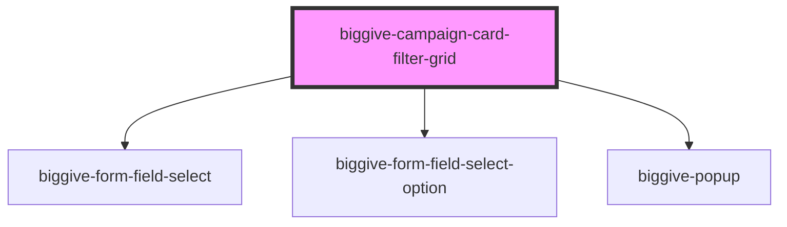

# biggive-campaign-filter-grid

<!-- Auto Generated Below -->

## Properties

| Property          | Attribute          | Description                                                                                     | Type     | Default                       |
| ----------------- | ------------------ | ----------------------------------------------------------------------------------------------- | -------- | ----------------------------- |
| `buttonText`      | `button-text`      | Defines the text on the search button                                                           | `string` | `'Search'`                    |
| `intro`           | `intro`            | Intro                                                                                           | `string` | `'Find a charity or project'` |
| `placeholderText` | `placeholder-text` | Defines the text displayed as the placeholder in the input field before the user types anything | `string` | `'Search'`                    |
| `spaceBelow`      | `space-below`      | Space below component                                                                           | `number` | `0`                           |

## Dependencies

### Depends on

- [biggive-form-field-select](../biggive-form-field-select)
- [biggive-form-field-select-option](../biggive-form-field-select-option)
- [biggive-popup](../biggive-popup)

### Graph

----------------------------------------------

*Built with [StencilJS](https://stenciljs.com/)*
