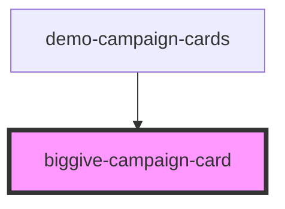

# biggive-campaign-card

<!-- Auto Generated Below -->

## Properties

| Property              | Attribute               | Description                                                                                                                      | Type       | Default     |
| --------------------- | ----------------------- | -------------------------------------------------------------------------------------------------------------------------------- | ---------- | ----------- |
| `banner`              | `banner`                | Full URL of a banner image.                                                                                                      | `string`   | `''`        |
| `beneficiaries`       | --                      | Array of full beneficiary labels.                                                                                                | `string[]` | `[]`        |
| `callToActionLabel`   | `call-to-action-label`  | Text for the link to `callToActionUrl`.                                                                                          | `string`   | `null`      |
| `callToActionUrl`     | `call-to-action-url`    | Full URL of a call to action.                                                                                                    | `string`   | `null`      |
| `campaignTitle`       | `campaign-title`        | Display name of the charity's specific time-bound fundraising campaign.                                                          | `string`   | `null`      |
| `campaignType`        | `campaign-type`         | e.g. "Match Funded".                                                                                                             | `string`   | `null`      |
| `categories`          | --                      | Array of full category labels.                                                                                                   | `string[]` | `[]`        |
| `currencyCode`        | `currency-code`         | e.g. 'GBP'.                                                                                                                      | `string`   | `undefined` |
| `daysRemaining`       | `days-remaining`        | (Ceiling of) whole number of days until campaign end.                                                                            | `number`   | `null`      |
| `matchFundsRemaining` | `match-funds-remaining` | Match funds not yet used or reserved, in major unit of currency e.g. pounds GBP.                                                 | `number`   | `null`      |
| `organisationName`    | `organisation-name`     | Display name of the charity or non-profit.                                                                                       | `string`   | `null`      |
| `target`              | `target`                | Target for the campaign including matching but excluding any tax relief, in major unit of currency e.g. pounds GBP.              | `number`   | `null`      |
| `totalFundsRaised`    | `total-funds-raised`    | Total the campaign has raised so far including matching but excluding any tax relief, in major unit of currency e.g. pounds GBP. | `number`   | `null`      |

## Dependencies

### Used by

 - [demo-campaign-cards](../demo-campaign-cards)

### Graph

----------------------------------------------

*Built with [StencilJS](https://stenciljs.com/)*
