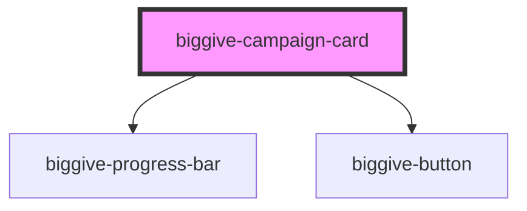

# biggive-campaign-card

Provides key information about a specific charity fundraising campaign, typically for use in a grid of multiple campaigns or
in a secondary column alongside more detail about the same campaign.

<!-- Auto Generated Below -->

## Properties

| Property              | Attribute                | Description                                                                                                                      | Type     | Default           |
| --------------------- | ------------------------ | -------------------------------------------------------------------------------------------------------------------------------- | -------- | ----------------- |
| `banner`              | `banner`                 | Full URL of a banner image.                                                                                                      | `string` | `''`              |
| `campaignTitle`       | `campaign-title`         | Display name of the charity's specific time-bound fundraising campaign.                                                          | `string` | `null`            |
| `campaignType`        | `campaign-type`          | e.g. "Match Funded".                                                                                                             | `string` | `null`            |
| `currencyCode`        | `currency-code`          | e.g. 'GBP'.                                                                                                                      | `string` | `undefined`       |
| `donateButtonLabel`   | `donate-button-label`    | Donate button label                                                                                                              | `string` | `'Donate now'`    |
| `donateButtonUrl`     | `donate-button-url`      | Donate button url                                                                                                                | `string` | `null`            |
| `matchFundsRemaining` | `match-funds-remaining`  | Match funds remaining.                                                                                                           | `number` | `null`            |
| `moreInfoButtonLabel` | `more-info-button-label` | More information button label                                                                                                    | `string` | `'Find out more'` |
| `moreInfoButtonUrl`   | `more-info-button-url`   | More information button url                                                                                                      | `string` | `null`            |
| `organisationName`    | `organisation-name`      | Display name of the charity or non-profit.                                                                                       | `string` | `null`            |
| `totalFundsRaised`    | `total-funds-raised`     | Total the campaign has raised so far including matching but excluding any tax relief, in major unit of currency e.g. pounds GBP. | `number` | `null`            |

## Dependencies

### Depends on

- [biggive-progress-bar](../biggive-progress-bar)
- [biggive-button](../biggive-button)

### Graph

----------------------------------------------

*Built with [StencilJS](https://stenciljs.com/)*
