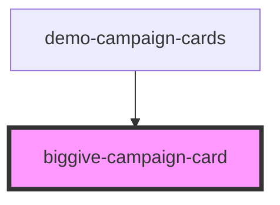

# biggive-campaign-card-test

<!-- Auto Generated Below -->

## Properties

| Property              | Attribute               | Description | Type     | Default |
| --------------------- | ----------------------- | ----------- | -------- | ------- |
| `banner`              | `banner`                |             | `string` | `null`  |
| `beneficiaries`       | `beneficiaries`         |             | `string` | `null`  |
| `callToActionLabel`   | `call-to-action-label`  |             | `string` | `null`  |
| `callToActionUrl`     | `call-to-action-url`    |             | `string` | `null`  |
| `campaignTitle`       | `campaign-title`        |             | `string` | `null`  |
| `campaignType`        | `campaign-type`         |             | `string` | `null`  |
| `categories`          | `categories`            |             | `string` | `null`  |
| `daysRemaining`       | `days-remaining`        |             | `number` | `null`  |
| `matchFundsRemaining` | `match-funds-remaining` |             | `number` | `null`  |
| `organisationName`    | `organisation-name`     |             | `string` | `null`  |
| `target`              | `target`                |             | `number` | `null`  |
| `totalFundsRaised`    | `total-funds-raised`    |             | `number` | `null`  |

## Dependencies

### Used by

 - [demo-campaign-cards](../demo-campaign-cards)

### Graph

----------------------------------------------

*Built with [StencilJS](https://stenciljs.com/)*
