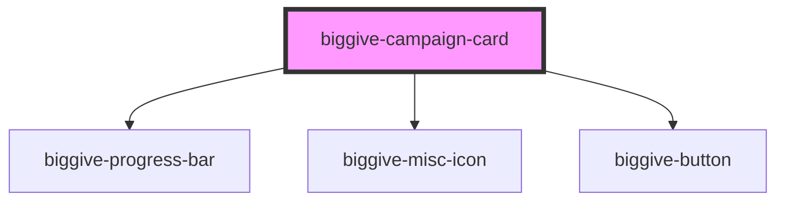

# biggive-campaign-card

Provides key information about a specific charity fundraising campaign, typically for use in a grid of multiple campaigns or
in a secondary column alongside more detail about the same campaign.

<!-- Auto Generated Below -->

## Properties

| Property                     | Attribute                        | Description                                                                                                                                                                                             | Type      | Default           |
| ---------------------------- | -------------------------------- | ------------------------------------------------------------------------------------------------------------------------------------------------------------------------------------------------------- | --------- | ----------------- |
| `banner`                     | `banner`                         | Full URL of a banner image.                                                                                                                                                                             | `string`  | `null`            |
| `campaignTitle`              | `campaign-title`                 | Display name of the charity's specific time-bound fundraising campaign.                                                                                                                                 | `string`  | `null`            |
| `campaignType`               | `campaign-type`                  | e.g. "Match Funded".                                                                                                                                                                                    | `string`  | `null`            |
| `datetime`                   | `datetime`                       | To be used alongside isFutureCampaign = true or isPastCampaign = true. If either is true, we render out: 'Launches: ' + datetime or 'Closed: ' + datetime. Preferred format: DD/MM/YYYY, HH:MM DON-661. | `string`  | `undefined`       |
| `donateButtonColourScheme`   | `donate-button-colour-scheme`    | Donate button colour scheme                                                                                                                                                                             | `string`  | `'primary'`       |
| `donateButtonLabel`          | `donate-button-label`            | Donate button label                                                                                                                                                                                     | `string`  | `'Donate now'`    |
| `donateButtonUrl`            | `donate-button-url`              | Donate button url                                                                                                                                                                                       | `string`  | `null`            |
| `isFutureCampaign`           | `is-future-campaign`             | Boolean flag telling the component if the campaign is in the future (not open yet).                                                                                                                     | `boolean` | `false`           |
| `isPastCampaign`             | `is-past-campaign`               | Boolean flag telling the component if the campaign is in the future (not open yet).                                                                                                                     | `boolean` | `false`           |
| `moreInfoButtonColourScheme` | `more-info-button-colour-scheme` | Donate button colour scheme                                                                                                                                                                             | `string`  | `'clear-primary'` |
| `moreInfoButtonLabel`        | `more-info-button-label`         | More information button label                                                                                                                                                                           | `string`  | `'Find out more'` |
| `moreInfoButtonUrl`          | `more-info-button-url`           | More information button url                                                                                                                                                                             | `string`  | `null`            |
| `organisationName`           | `organisation-name`              | Display name of the charity or non-profit.                                                                                                                                                              | `string`  | `null`            |
| `primaryFigureAmount`        | `primary-figure-amount`          | Amount for the primary figure, formatted with currency symbol                                                                                                                                           | `string`  | `null`            |
| `primaryFigureLabel`         | `primary-figure-label`           | Label for the primary figure                                                                                                                                                                            | `string`  | `null`            |
| `progressBarCounter`         | `progress-bar-counter`           | Progress bar percentage                                                                                                                                                                                 | `number`  | `100`             |
| `secondaryFigureAmount`      | `secondary-figure-amount`        | Amount for the secondary figure, formatted with currency symbol                                                                                                                                         | `string`  | `null`            |
| `secondaryFigureLabel`       | `secondary-figure-label`         | Label for the secondary figure                                                                                                                                                                          | `string`  | `null`            |
| `spaceBelow`                 | `space-below`                    | Space below component                                                                                                                                                                                   | `number`  | `4`               |

## Events

| Event                | Description | Type                                           |
| -------------------- | ----------- | ---------------------------------------------- |
| `doCardGeneralClick` |             | `CustomEvent<{ event: object; url: string; }>` |

## Dependencies

### Depends on

- [biggive-progress-bar](../biggive-progress-bar)
- [biggive-misc-icon](../biggive-misc-icon)
- [biggive-button](../biggive-button)

### Graph

----------------------------------------------

*Built with [StencilJS](https://stenciljs.com/)*
