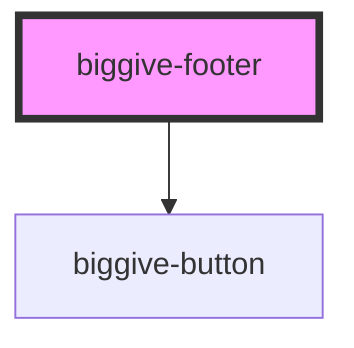

# biggive-footer

<!-- Auto Generated Below -->

## Properties

| Property             | Attribute              | Description | Type                         | Default     |
| -------------------- | ---------------------- | ----------- | ---------------------------- | ----------- |
| `headingLevel`       | `heading-level`        |             | `1 \| 2 \| 3 \| 4 \| 5 \| 6` | `5`         |
| `postscriptNavTitle` | `postscript-nav-title` |             | `string \| undefined`        | `undefined` |
| `primaryNavTitle`    | `primary-nav-title`    |             | `string \| undefined`        | `undefined` |
| `secondaryNavTitle`  | `secondary-nav-title`  |             | `string \| undefined`        | `undefined` |
| `tertiaryNavTitle`   | `tertiary-nav-title`   |             | `string \| undefined`        | `undefined` |

## Dependencies

### Depends on

- [biggive-button](../biggive-button)

### Graph

----------------------------------------------

*Built with [StencilJS](https://stenciljs.com/)*
