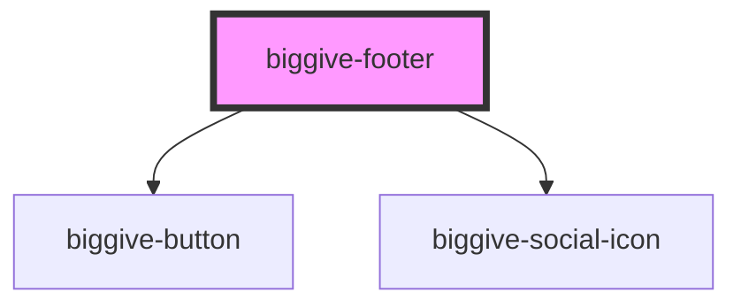

# biggive-footer

<!-- Auto Generated Below -->

## Properties

| Property              | Attribute               | Description                                                                                                                 | Type                         | Default     |
| --------------------- | ----------------------- | --------------------------------------------------------------------------------------------------------------------------- | ---------------------------- | ----------- |
| `blogUrlPrefix`       | `blog-url-prefix`       | URL prefixes vary by environment, and components library is not best placed to know what they are, so we take them as props | `string \| undefined`        | `undefined` |
| `experienceUrlPrefix` | `experience-url-prefix` |                                                                                                                             | `string \| undefined`        | `undefined` |
| `headingLevel`        | `heading-level`         |                                                                                                                             | `1 \| 2 \| 3 \| 4 \| 5 \| 6` | `5`         |
| `usePresetFooter`     | `use-preset-footer`     | Conditionally render footer menu: hard-coded (preset) when set to true, dynamic (slot-based) when set to false              | `boolean`                    | `false`     |

## Dependencies

### Depends on

- [biggive-button](../biggive-button)
- [biggive-social-icon](../biggive-social-icon)

### Graph

----------------------------------------------

*Built with [StencilJS](https://stenciljs.com/)*
