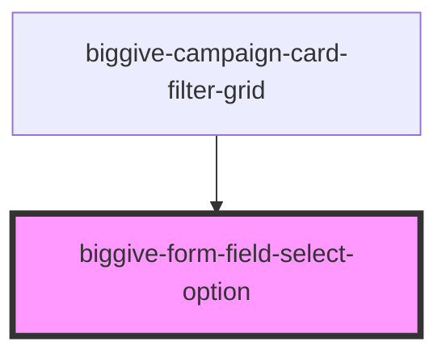

# biggive-form-field-select-option

<!-- Auto Generated Below -->

## Properties

| Property | Attribute | Description | Type     | Default |
| -------- | --------- | ----------- | -------- | ------- |
| `label`  | `label`   | Label       | `string` | `null`  |
| `value`  | `value`   | Value       | `string` | `null`  |

## Events

| Event            | Description                                                                                          | Type                  |
| ---------------- | ---------------------------------------------------------------------------------------------------- | --------------------- |
| `doOptionSelect` | This event `doOptionSelect` event is emitted and propogates to the parent component which handles it | `CustomEvent<object>` |

## Dependencies

### Used by

 - [biggive-campaign-card-filter-grid](../biggive-campaign-card-filter-grid)

### Graph

----------------------------------------------

*Built with [StencilJS](https://stenciljs.com/)*
