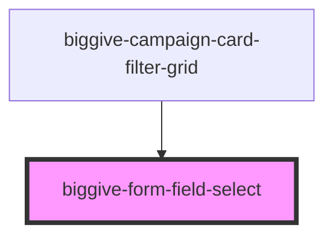

# biggive-form-field-select

<!-- Auto Generated Below -->

## Properties

| Property               | Attribute           | Description                                                                           | Type                                 | Default      |
| ---------------------- | ------------------- | ------------------------------------------------------------------------------------- | ------------------------------------ | ------------ |
| `backgroundColour`     | `background-colour` | Must match background of containing element, or unintended shape will appear.         | `"grey" \| "white"`                  | `undefined`  |
| `onSelectionChange`    | --                  |                                                                                       | `(value: string) => void`            | `undefined`  |
| `options` _(required)_ | `options`           | JSON array of category key/values, or takes a stringified equiavalent (for Storybook) | `string \| { [x: string]: string; }` | `undefined`  |
| `placeholder`          | `placeholder`       | Placeholder                                                                           | `string \| undefined`                | `undefined`  |
| `prompt` _(required)_  | `prompt`            | Displayed as 'eyebrow' label over the top border of the box.                          | `null \| string`                     | `undefined`  |
| `selectStyle`          | `select-style`      |                                                                                       | `"bordered" \| "underlined"`         | `'bordered'` |
| `selectedLabel`        | `selected-label`    |                                                                                       | `null \| string`                     | `undefined`  |
| `selectedValue`        | `selected-value`    |                                                                                       | `null \| string`                     | `undefined`  |
| `spaceBelow`           | `space-below`       | Space below component                                                                 | `number`                             | `0`          |

## Dependencies

### Used by

 - [biggive-campaign-card-filter-grid](../biggive-campaign-card-filter-grid)

### Graph

----------------------------------------------

*Built with [StencilJS](https://stenciljs.com/)*
