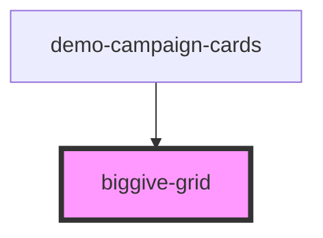

# biggive-grid

A simple flexbox grid of anything!

<!-- Auto Generated Below -->

## Properties

| Property      | Attribute      | Description  | Type     | Default |
| ------------- | -------------- | ------------ | -------- | ------- |
| `columnCount` | `column-count` | Column count | `number` | `3`     |
| `columnGap`   | `column-gap`   | Column gap   | `number` | `3`     |

## Dependencies

### Used by

 - [demo-campaign-cards](../demo-campaign-cards)

### Graph

----------------------------------------------

*Built with [StencilJS](https://stenciljs.com/)*
