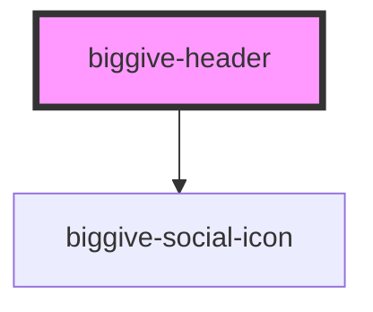

# biggive-header

<!-- Auto Generated Below -->

## Properties

| Property     | Attribute     | Description           | Type     | Default |
| ------------ | ------------- | --------------------- | -------- | ------- |
| `spaceBelow` | `space-below` | Space below component | `number` | `0`     |

## Dependencies

### Depends on

- [biggive-social-icon](../biggive-social-icon)

### Graph

----------------------------------------------

*Built with [StencilJS](https://stenciljs.com/)*
