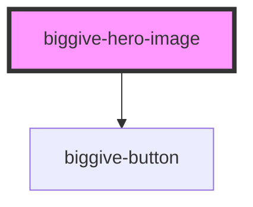

# biggive-hero-image

Provides a large format image-based header feature, typically used at the top of a page. Features an image, title, plus teaser text

<!-- Auto Generated Below -->

## Properties

| Property                   | Attribute                     | Description                           | Type     | Default     |
| -------------------------- | ----------------------------- | ------------------------------------- | -------- | ----------- |
| `buttonColourScheme`       | `button-colour-scheme`        | Button Colour Scheme                  | `string` | `'primary'` |
| `buttonLabel`              | `button-label`                | Button Label                          | `string` | `null`      |
| `buttonUrl`                | `button-url`                  | Button Url                            | `string` | `null`      |
| `colourScheme`             | `colour-scheme`               | Colour Scheme                         | `string` | `'primary'` |
| `logo`                     | `logo`                        | Full URL of a logo image.             | `string` | `''`        |
| `logoAltText`              | `logo-alt-text`               | Logo alt text                         | `string` | `''`        |
| `mainImage`                | `main-image`                  | Full URL of a main hero image.        | `string` | `null`      |
| `mainImageAlignHorizontal` | `main-image-align-horizontal` | Horizontal alignment of image         | `string` | `'center'`  |
| `mainImageAlignVertical`   | `main-image-align-vertical`   | Vertical alignment of image           | `string` | `'center'`  |
| `mainTitle`                | `main-title`                  | Hero image title, typically the page. | `string` | `null`      |
| `mainTitleColour`          | `main-title-colour`           | Main title colour                     | `string` | `null`      |
| `slug`                     | `slug`                        | Header slug                           | `string` | `null`      |
| `slugColour`               | `slug-colour`                 | Header slug colour                    | `string` | `null`      |
| `spaceBelow`               | `space-below`                 | Space below component                 | `number` | `0`         |
| `teaser`                   | `teaser`                      | Introductory teaser text              | `string` | `null`      |
| `teaserColour`             | `teaser-colour`               | Teaser colour                         | `string` | `null`      |

## Dependencies

### Depends on

- [biggive-button](../biggive-button)

### Graph

----------------------------------------------

*Built with [StencilJS](https://stenciljs.com/)*
