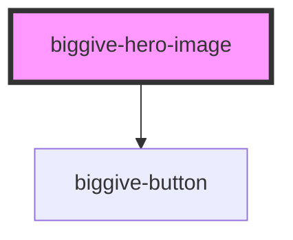

# biggive-hero-image

Provides a large format image-based header feature, typically used at the top of a page. Features an image, title, plus teaser text

<!-- Auto Generated Below -->

## Properties

| Property       | Attribute       | Description                           | Type     | Default     |
| -------------- | --------------- | ------------------------------------- | -------- | ----------- |
| `buttonLabel`  | `button-label`  | Button Label                          | `string` | `null`      |
| `buttonUrl`    | `button-url`    | Button Url                            | `string` | `null`      |
| `colourScheme` | `colour-scheme` | Colour Scheme                         | `string` | `'primary'` |
| `mainImage`    | `main-image`    | Full URL of a main hero image.        | `string` | `''`        |
| `mainTitle`    | `main-title`    | Hero image title, typically the page. | `string` | `null`      |
| `slug`         | `slug`          | Header slug                           | `string` | `null`      |
| `teaser`       | `teaser`        | Introductory teaser text              | `string` | `null`      |

## Dependencies

### Depends on

- [biggive-button](../biggive-button)

### Graph

----------------------------------------------

*Built with [StencilJS](https://stenciljs.com/)*
