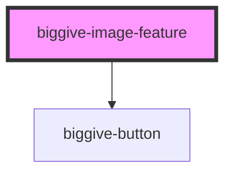

# biggive-graphic

<!-- Auto Generated Below -->

## Properties

| Property             | Attribute              | Description              | Type     | Default     |
| -------------------- | ---------------------- | ------------------------ | -------- | ----------- |
| `buttonColourScheme` | `button-colour-scheme` | Button Colour Scheme     | `string` | `'primary'` |
| `buttonLabel`        | `button-label`         | Button Label             | `string` | `null`      |
| `buttonUrl`          | `button-url`           | Button Url               | `string` | `null`      |
| `defaultTextColour`  | `default-text-colour`  | Default text colour      | `string` | `'primary'` |
| `imageAltText`       | `image-alt-text`       | Image alt text tag.      | `string` | `''`        |
| `imageUrl`           | `image-url`            | Full URL of a image.     | `string` | `''`        |
| `mainTitle`          | `main-title`           | Video title              | `string` | `null`      |
| `mainTitleColour`    | `main-title-colour`    | Slug colour              | `string` | `''`        |
| `slug`               | `slug`                 | Slug                     | `string` | `null`      |
| `slugColour`         | `slug-colour`          | Slug colour              | `string` | `''`        |
| `spaceBelow`         | `space-below`          | Space below component    | `number` | `0`         |
| `teaser`             | `teaser`               | Introductory teaser text | `string` | `null`      |
| `teaserColour`       | `teaser-colour`        | Teaser colour            | `string` | `''`        |

## Dependencies

### Depends on

- [biggive-button](../biggive-button)

### Graph

----------------------------------------------

*Built with [StencilJS](https://stenciljs.com/)*
