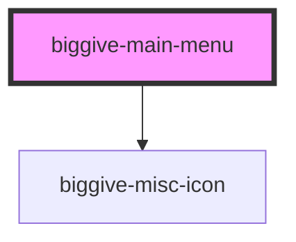

# biggive-main-menu

<!-- Auto Generated Below -->

## Properties

| Property               | Attribute                 | Description                                                                                                                                                                                                   | Type      | Default |
| ---------------------- | ------------------------- | ------------------------------------------------------------------------------------------------------------------------------------------------------------------------------------------------------------- | --------- | ------- |
| `logoUrl`              | `logo-url`                |                                                                                                                                                                                                               | `string`  | `'/'`   |
| `usePresetMenuContent` | `use-preset-menu-content` | If true, content passed in via slots will be ignored, and this will just render a hard-coded menu that's the same everywhere. When BG2-2286 is done this will be permantly true and the prop will be deleted. | `boolean` | `false` |

## Methods

### `closeMobileMenuFromOutside() => Promise<void>`

#### Returns

Type: `Promise<void>`

## Dependencies

### Depends on

- [biggive-misc-icon](../biggive-misc-icon)

### Graph

----------------------------------------------

*Built with [StencilJS](https://stenciljs.com/)*
