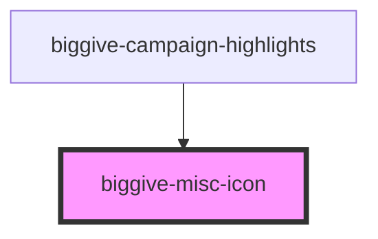

# biggive-icon

<!-- Auto Generated Below -->

## Properties

| Property | Attribute | Description | Type     | Default |
| -------- | --------- | ----------- | -------- | ------- |
| `icon`   | `icon`    | Icon        | `string` | `null`  |
| `url`    | `url`     | Url         | `string` | `'#'`   |

## Dependencies

### Used by

 - [biggive-campaign-highlights](../biggive-campaign-highlights)

### Graph

----------------------------------------------

*Built with [StencilJS](https://stenciljs.com/)*
