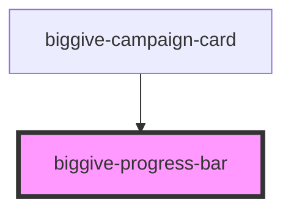

# biggive-progress-bar

<!-- Auto Generated Below -->

## Properties

| Property       | Attribute       | Description   | Type     | Default     |
| -------------- | --------------- | ------------- | -------- | ----------- |
| `colourScheme` | `colour-scheme` | Colour Scheme | `string` | `'primary'` |
| `counter`      | `counter`       | Text          | `number` | `100`       |

## Dependencies

### Used by

 - [biggive-campaign-card](../biggive-campaign-card)

### Graph

----------------------------------------------

*Built with [StencilJS](https://stenciljs.com/)*
