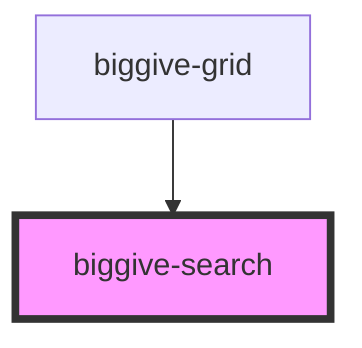

# biggive-search

Provides a text field for users to search for campaigns and/or charities.


## How to Use the BigGiveSearch Component:
The search component is designed for ease of integration. The component must be rendered from a parent
component.

Firstly, add a function as follows in the class of the parent component:
```
    search(searchText: string) {
        // insert your search functionality here
    }
```

Then, you can simply add the search component to the TSX/JSX DOM of the parent as follows:
```
    <biggive-search doSearch={this.search} />
```

That's it! The search component should take up the full width of the container it's placed inside (in
the parent component).

<!-- Auto Generated Below -->


## Properties

| Property          | Attribute          | Description                                                                                           | Type       | Default     |
| ----------------- | ------------------ | ----------------------------------------------------------------------------------------------------- | ---------- | ----------- |
| `buttonText`      | `button-text`      |                                                                                                       | `string`   | `undefined` |
| `doSearch`        | --                 | This prop points to the memory address of the *real* search function on the parent of this component. | `Function` | `undefined` |
| `placeholderText` | `placeholder-text` |                                                                                                       | `string`   | `undefined` |


## Dependencies

### Used by

 - [biggive-grid](../biggive-grid)

### Graph


----------------------------------------------

*Built with [StencilJS](https://stenciljs.com/)*
