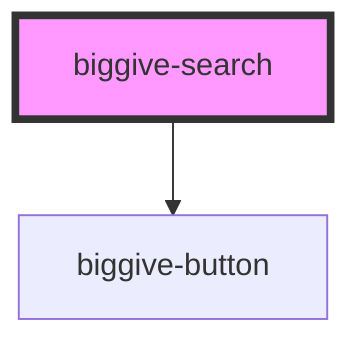

# biggive-search

Provides a text field for users to search for campaigns and/or charities.


## How to Use the BigGiveSearch Component:
The search component is designed for ease of integration. The component must be rendered from a parent
component.

Firstly, don't forget to import `{ Listen }`, and then add an event listener function to do the search implementation as shown below:
```
    import { Listen } from '@stencil/core';

    ...
    export class ParentComponent {
        @Listen('doSearch')
        doSearchEventHandler(event: CustomEvent<string>) {
            // insert search implementation here
            alert('Performing `doSearch` with the following searchText: ' + event.detail);
        }
    }
```

Then, you can simply add the search component to the TSX/JSX DOM of the parent as follows:
```
    <biggive-search
        doSearch={this.search}
        placeholderText='Search'
        buttonText='Search'
    />
```

That's it! The search component should take up the full width of the container it's placed inside (in
the parent component).

<!-- Auto Generated Below -->


## Properties

| Property          | Attribute          | Description                                                                                     | Type     | Default     |
| ----------------- | ------------------ | ----------------------------------------------------------------------------------------------- | -------- | ----------- |
| `buttonText`      | `button-text`      | Defines the text on the search button                                                           | `string` | `undefined` |
| `placeholderText` | `placeholder-text` | Defines the text displayed as the placeholder in the input field before the user types anything | `string` | `undefined` |
| `searchText`      | `search-text`      |                                                                                                 | `string` | `null`      |


## Events

| Event      | Description                                                                                    | Type                  |
| ---------- | ---------------------------------------------------------------------------------------------- | --------------------- |
| `doSearch` | This event `doSearch` event is emitted and propogates to the parent component which handles it | `CustomEvent<string>` |


## Dependencies

### Depends on

- [biggive-button](../biggive-button)

### Graph


----------------------------------------------

*Built with [StencilJS](https://stenciljs.com/)*
