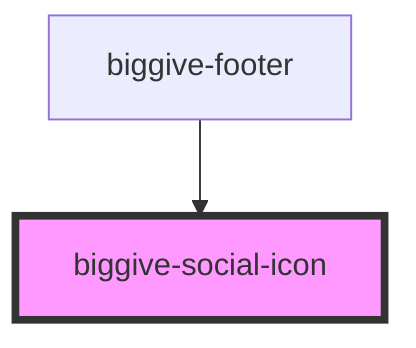

# biggive-social-icon

<!-- Auto Generated Below -->

## Properties

| Property           | Attribute           | Description       | Type     | Default     |
| ------------------ | ------------------- | ----------------- | -------- | ----------- |
| `backgroundColour` | `background-colour` | Background colour | `string` | `'primary'` |
| `iconColour`       | `icon-colour`       | Background colour | `string` | `'white'`   |
| `service`          | `service`           | service           | `string` | `'Twitter'` |
| `url`              | `url`               | Url               | `string` | `'#'`       |

## Dependencies

### Used by

 - [biggive-footer](../biggive-footer)

### Graph

----------------------------------------------

*Built with [StencilJS](https://stenciljs.com/)*
