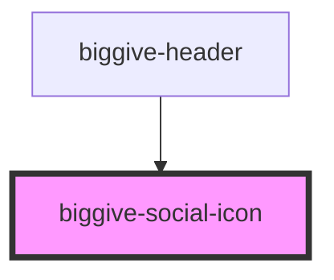

# biggive-social-icon

<!-- Auto Generated Below -->

## Properties

| Property  | Attribute | Description | Type     | Default     |
| --------- | --------- | ----------- | -------- | ----------- |
| `service` | `service` | service     | `string` | `'Twitter'` |
| `url`     | `url`     | Url         | `string` | `'#'`       |

## Dependencies

### Used by

 - [biggive-header](../biggive-header)

### Graph

----------------------------------------------

*Built with [StencilJS](https://stenciljs.com/)*
