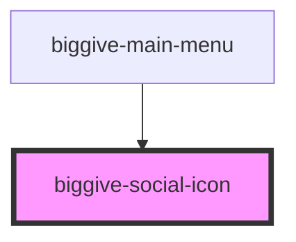

# biggive-social-icon

<!-- Auto Generated Below -->

## Properties

| Property           | Attribute           | Description                                                                                                    | Type      | Default     |
| ------------------ | ------------------- | -------------------------------------------------------------------------------------------------------------- | --------- | ----------- |
| `backgroundColour` | `background-colour` | Background colour                                                                                              | `string`  | `'primary'` |
| `iconColour`       | `icon-colour`       | Icon colour                                                                                                    | `string`  | `'white'`   |
| `service`          | `service`           | Service name                                                                                                   | `string`  | `'Twitter'` |
| `url`              | `url`               | Url                                                                                                            | `string`  | `'#'`       |
| `wide`             | `wide`              | Used in the social icons in the biggive-footer, which are more spaced out than others across the site. COM-43. | `boolean` | `false`     |

## Dependencies

### Used by

 - [biggive-main-menu](../biggive-main-menu)

### Graph

----------------------------------------------

*Built with [StencilJS](https://stenciljs.com/)*
