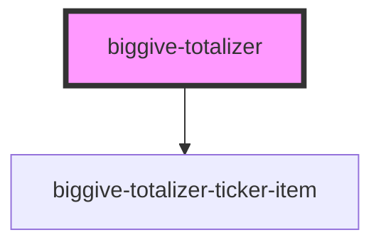

# biggive-totalizer

<!-- Auto Generated Below -->

## Properties

| Property              | Attribute               | Description             | Type                                   | Default       |
| --------------------- | ----------------------- | ----------------------- | -------------------------------------- | ------------- |
| `mainMessage`         | `main-message`          | Primary message         | `string`                               | `null`        |
| `primaryColour`       | `primary-colour`        | Primary banner colour   | `string`                               | `'primary'`   |
| `primaryTextColour`   | `primary-text-colour`   | Primary text colour     | `string`                               | `'white'`     |
| `secondaryColour`     | `secondary-colour`      | Secondary banner colour | `string`                               | `'secondary'` |
| `secondaryTextColour` | `secondary-text-colour` | Secondary text colour   | `string`                               | `'black'`     |
| `spaceBelow`          | `space-below`           | Space below component   | `number`                               | `0`           |
| `tickerItems`         | --                      |                         | `{ label: string; figure: string; }[]` | `[]`          |

## Dependencies

### Depends on

- [biggive-totalizer-ticker-item](../biggive-totalizer-ticker-item)

### Graph

----------------------------------------------

*Built with [StencilJS](https://stenciljs.com/)*
