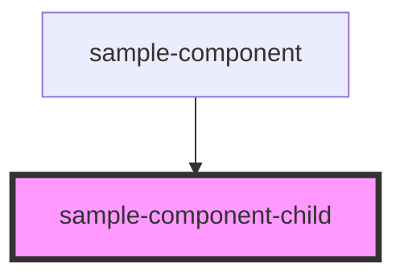

# sample-component-child

<!-- Auto Generated Below -->

## Properties

| Property | Attribute | Description | Type     | Default |
| -------- | --------- | ----------- | -------- | ------- |
| `text`   | `text`    |             | `string` | `""`    |
| `url`    | `url`     |             | `string` | `""`    |

## Dependencies

### Used by

 - [sample-component](../sample-component)

### Graph

----------------------------------------------

*Built with [StencilJS](https://stenciljs.com/)*
