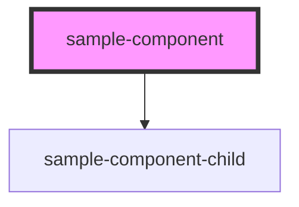

# sample-component

<!-- Auto Generated Below -->

## Properties

| Property           | Attribute             | Description | Type     | Default |
| ------------------ | --------------------- | ----------- | -------- | ------- |
| `callToActionText` | `call-to-action-text` |             | `string` | `""`    |
| `callToActionUrl`  | `call-to-action-url`  |             | `string` | `""`    |
| `label`            | `label`               |             | `string` | `""`    |
| `meta`             | `meta`                |             | `string` | `""`    |

## Dependencies

### Depends on

- [sample-component-child](../sample-component-child)

### Graph

----------------------------------------------

*Built with [StencilJS](https://stenciljs.com/)*
